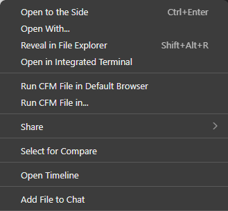
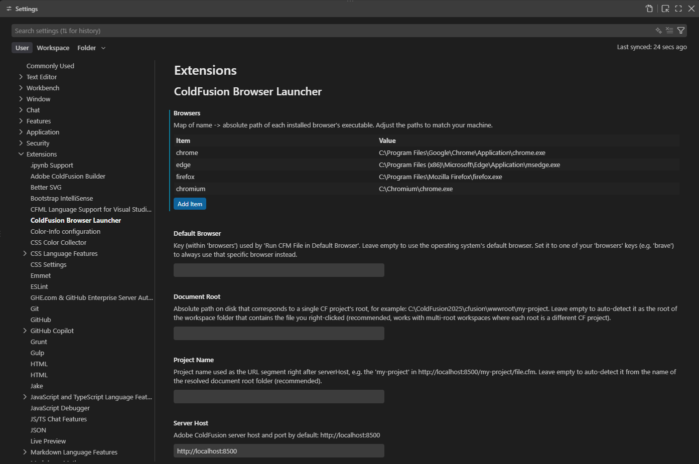

# ColdFusion Browser Launcher

Open `.cfm` files against your local Adobe ColdFusion server, in a browser of your
choice — without touching your operating system's default browser.

This solves a specific gap in the Adobe ColdFusion Builder extension for VS Code:
its "Run As ColdFusion Application" command always opens your OS default browser,
with no way to pick a different one. That's inconvenient if your main browser is
full of saved sessions, cookies, and passwords you don't want to clear constantly
during development.

## Features

Right-click any `.cfm` file in the Visual Studio Code Explorer panel to get two new options:

- **Run CFM File in Default Browser** — instantly opens the file's URL. Uses your
  operating system's default browser out of the box; you can point it at a specific
  browser instead (see Configuration below).
- **Run CFM File in...** — shows a picker to choose which configured browser to use,
  just for that one run.

The extension automatically builds the correct URL for the file you clicked,
detecting which CF project it belongs to from your open workspace folder — no need
to type the URL by hand every time.

It doesn't modify or depend on the Adobe ColdFusion Builder extension; it's fully
independent and works alongside it.

## Usage

1. Make sure your ColdFusion server is running locally (e.g. `http://localhost:8500`).
2. Open your CF project folder in VS Code.
3. Right-click any `.cfm` file → **Run CFM File in Default Browser** or
   **Run CFM File in...**.

 

## Extension Settings

Go to `Settings` (Ctrl+,) and search for `ColdFusion Browser Launcher`, or edit your
`settings.json` directly:



```jsonc
{
  "cfBrowserLauncher.serverHost": "http://localhost:8500",
  "cfBrowserLauncher.documentRoot": "", // empty = auto-detect from the workspace folder
  "cfBrowserLauncher.projectName": "", // empty = auto-detect from the folder name
  "cfBrowserLauncher.defaultBrowser": "", // empty = use the OS default browser
  "cfBrowserLauncher.browsers": {
    "chrome": "C:\\Program Files\\Google\\Chrome\\Application\\chrome.exe",
    "edge": "C:\\Program Files (x86)\\Microsoft\\Edge\\Application\\msedge.exe",
    "firefox": "C:\\Program Files\\Mozilla Firefox\\firefox.exe",
    "chromium": "C:\\Chromium\\chrome.exe"
  }
}
```

| Setting | Default | Description |
|---|---|---|
| `serverHost` | `http://localhost:8500` | Your ColdFusion server's host and port, without the project name. |
| `documentRoot` | *(empty)* | Absolute path to a specific CF project's root. Leave empty to auto-detect it from the workspace folder that contains the file you clicked. |
| `projectName` | *(empty)* | The URL segment right after `serverHost`. Leave empty to auto-detect it from the resolved document root's folder name. |
| `defaultBrowser` | *(empty)* | Which entry in `browsers` to use for "Run CFM File in Default Browser". Leave empty to use your OS default browser instead of a specific one. |
| `browsers` | Chrome, Edge, Firefox, Chromium | Map of browser name → absolute path to its executable. Add, edit, or remove entries from the Settings UI (a table with an "Add Item" button), or edit `settings.json` directly. |

### About auto-detection (`documentRoot` and `projectName`)

By default (both left empty), the extension:

1. Finds the workspace folder that contains the `.cfm` file you right-clicked, and
   uses it as `documentRoot`.
2. Uses that folder's own name as `projectName`.
3. Builds the URL as `serverHost/projectName/relativePathToFile`.

This works out of the box whenever your local folder name matches the project name
your CF server uses (the common case), and it also works correctly in **multi-root
workspaces** — each root folder is resolved independently, so you can have several CF
projects open at once and each `.cfm` resolves to its own project's URL.

Override when needed:
- Set **`projectName`** if your local folder name doesn't match the URL segment the
  CF server expects (e.g. folder is `my-project-dev` but the server maps it as
  `myproject`).
- Set **`documentRoot`** if the actual CF project root is a *subfolder* of your open
  workspace, rather than the workspace root itself.

## Requirements

- A locally running Adobe ColdFusion server.
- The browser(s) you want to use already installed, with their executable paths
  configured in `browsers`.

## Known Limitations

- Right-click menu labels are static — they can't show the file name or the selected
  browser's name (a VS Code platform limitation), only the run notification and the
  "Run CFM File in..." picker do.
- URL building assumes the CF convention where the URL path mirrors the file's path
  on disk. It isn't meant for frameworks with client-side or code-based routing
  (Blazor, Angular, and similar).
- Assumes the standard single-webroot layout (`serverHost/projectName/...`). If your
  ColdFusion server uses **Virtual Host** settings (a project mapped to its own
  domain or port, with no project name in the URL), set `serverHost` to that
  project's full domain/port and `projectName` to whatever segment (if any) its URLs
  actually use — there's currently no way to omit the project segment entirely.

## Release Notes

### 1.0.1

Initial release: run `.cfm` files against a local ColdFusion server in a browser of
your choice, right from the Explorer context menu.

## Author

FrameCode Inc.